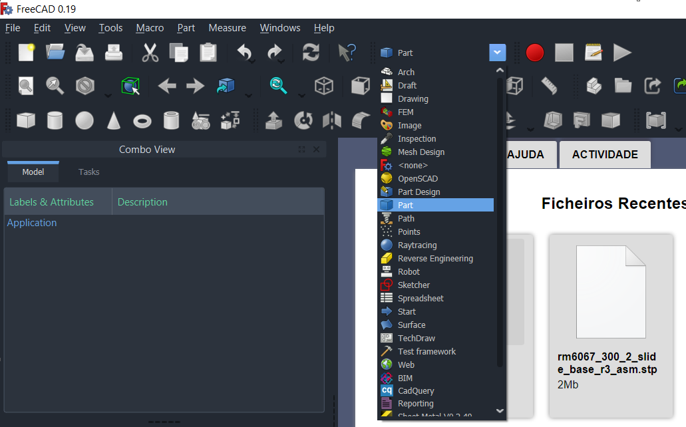
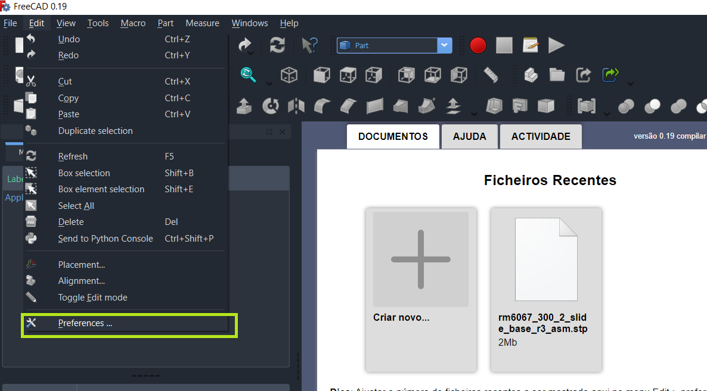
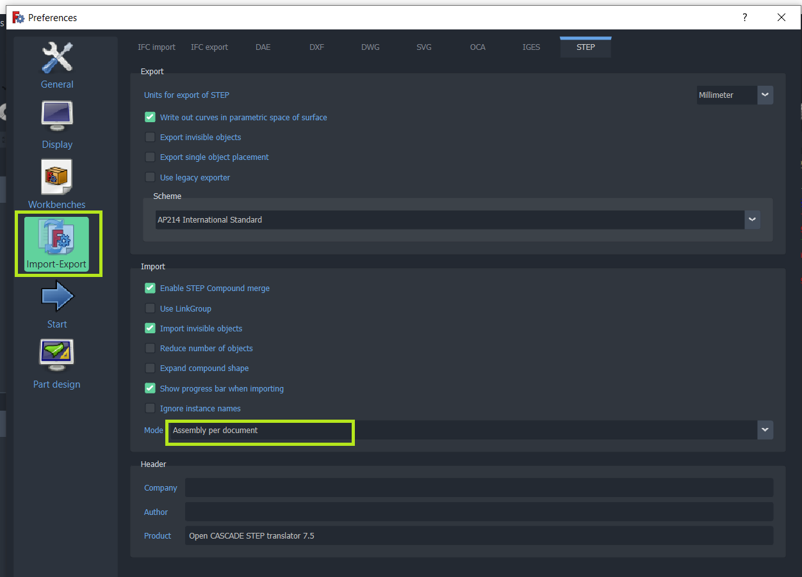
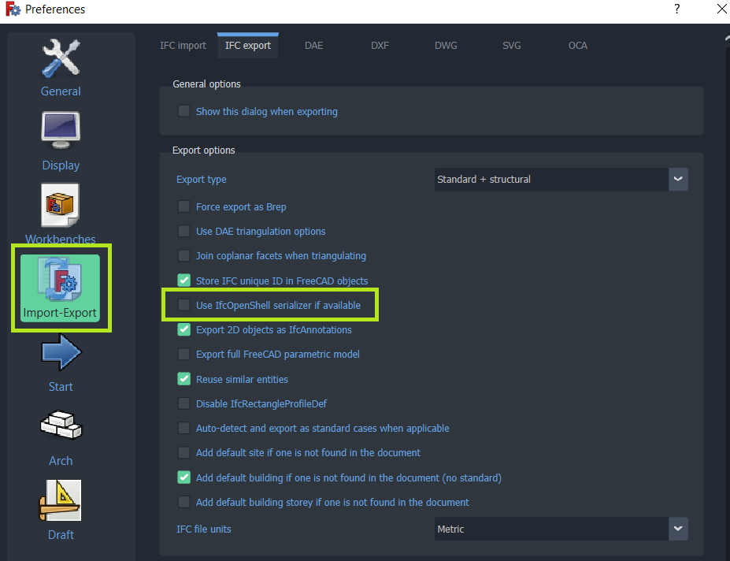
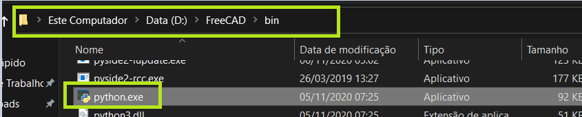

# **step_to_ifc**

Since I didn't find a way to export an STEP assembly with multiple levels to IFC, I'm exploring how to do it using FreeCAD.
The plan is to produce these things:

- A python script that communicates with FreeCAD and imports the STEP and exports the IFC(this is mostly done and now has loggings!)
- An electron UI to set the detail of the process and set the IFC properties(in development)

# How it works

It's a python script that imports the model into FreeCAD and creates one IFC entity for every component or sub-assembly in the STEP file.

# How to use

1. First one should install the latest [FreeCAD](https://www.freecadweb.org/)

2. Open FreeCAD and go to Part workbench



3. Go to preferences



4. In the option Import/Export, go to STEP and change the mode to "assembly per document". This will set FreeCAD to import the STEP files using their original tree structure



5. While in the Preferences, go to IFC export and uncheck the option to use the IfcOpenShell serializer



6. Now find the path to the python.exe inside the FreeCAD/bin folder



7. Run the script using the FreeCAD's python, then use the STEP assembly filename and the output IFC filename as arguments

```bash
> D:\FreeCAD\bin\python.exe freecad_step_to_ifc.py "<file_path.stp>" "<file_path.ifc>"
```

Notes: 

- I'm using [IFC++](https://ifcquery.com/) to visualize and debug the models
- I'm using [FreeCAD](https://www.freecadweb.org/) v0.19 for better IFC support
- If you're interested in some more info check the notes folder 
- Be aware that I'm not a programmer, I'm an engineer with a lot of curiosity and some programming knowledge. Feel free to comment and sugest stuff

Contact: pedro.moresco93@outlook.com
