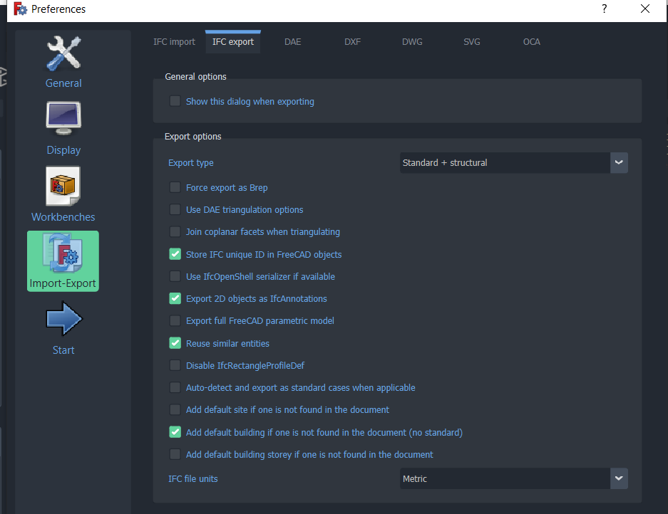

# Export STEP to IFC in FreeCAD

When working with simple single parts file, this process is seamless.
But when doing it in a assembly, specially a very nested assembly, this
is a little complicated.

First, you need to change the options in FreeCAD to import the STEP assembly
as a *"assembly per document"*. Then one will have the correct tree strucuture.

If you just export the model to IFC, then the only item exported will be the
top element, and there will be no shape. 
It makes sense, since the top element is just a conglomerate of individual
pieces.

**Use the ifc++ to visualize the ifc models and tree info**

The use of the IfcOpenShell is unadvised because it showed difficulties exporting folded sheet metal parts. But one can test for their specific application. The geometies are indeed more refined, specially the round ones.

By this moment, the best option is to use the python installation present in the FreeCAD\bin.
In this way, all the modules are loaded. The UI has to be loaded to, in order to properly load all the methods.

Since the start I realized that the options in the import STEP/export IFC have to be tweaked to work together. So to provide a little more of information about them I implemented log files for the exports, so one can keep track of time, hardware, etc. I help that in the future this help to facilitate the debug process in case something goes wrong.

# Logging details of the conversion

## Logging
- `logging.info`: Report of normal operations
- `logging.debug`: Report for debugging purposes
- `logging.warning`: Report an event that must be corrected
- `logging.error`: Report an error

### Logging to a file
```python
import logging
logging.basicConfig(filename='example.log', level=logging.DEBUG, format='%(asctime)s:%(levelname)s:%(message)s', datefmt='%H:%M:%S')
logging.debug('This message will go into the file')
logging.info('This one too')
logging.warning('This too')
logging.error('There an non-ASCII character')
```
- Note: Theres a hierarchy to the log level, so use the debug so all the messages are parsed
## Get the details of the machine
- `platform.platform()`: OS and building version
- `platform.node()`: Name of the machine
- `platform.processor()`: Name of the processor
- Get the amount of RAM(Test this!)
```python
import os
process = os.popen('wmic memorychip get capacity')
result = process.read()
process.close()
try:
    # Get the amount of RAM in Gb
    totalMem = float(result.replace('\n', '').strip().split(' ')[-1])/1024**3
except: 
    totalMem = 0
```
- Get total time of the run
## Get details of the STEP and IFC file
- TODO Get FreeCAD's settings details
- Register the name of the files
- `os.path.getsize(<path>)/1024**2`: Size of file in MB
- `len(obj.OutListRecursive)`:Number of entities(Get the FreeCAD OutListRecursive)
- Details from FreeCAD:
```python
# Get the version data
fVersion = FreeCAD.Version()
# Get the version
version = 'v{}.{}'.format(fVersion[0], fVersion[1])
build = fVsersion[2]
```

# Test the export IFC options



- Note: Maybe suggest the ideal configuration for exporting IFC
## Force export as Brep
## Use DAE triangulation options
## Join coplanar facets when triangulating
## Store IFC unique ID in FreeCAD objects
## Use IfcOpenShell serializer if avaible
## Export 2D objects as IfcAnnotations
## Export full FreeCAD parametric model
## Reuse similar entities
## Disable IfcRectangleProfileDef
## Auto-detect and export as standard cases when applicable

# Improve performance

## Usage of multitread/multiprocessing
## Investigate how exportIFC works
## Investigate how the STEP import stuff and change the name engine!!!